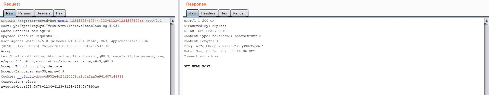
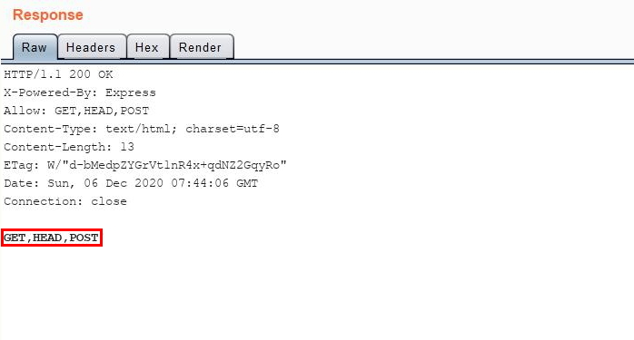
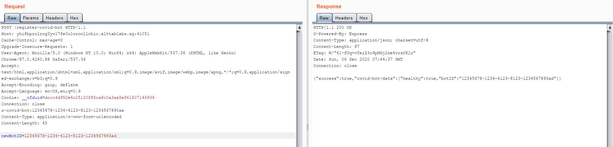
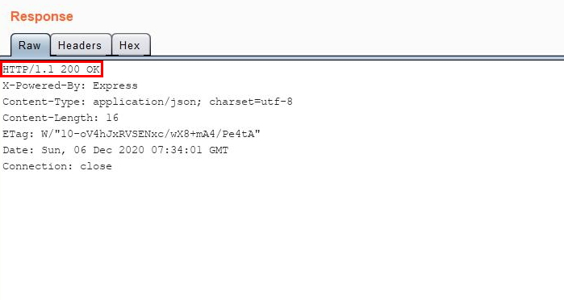
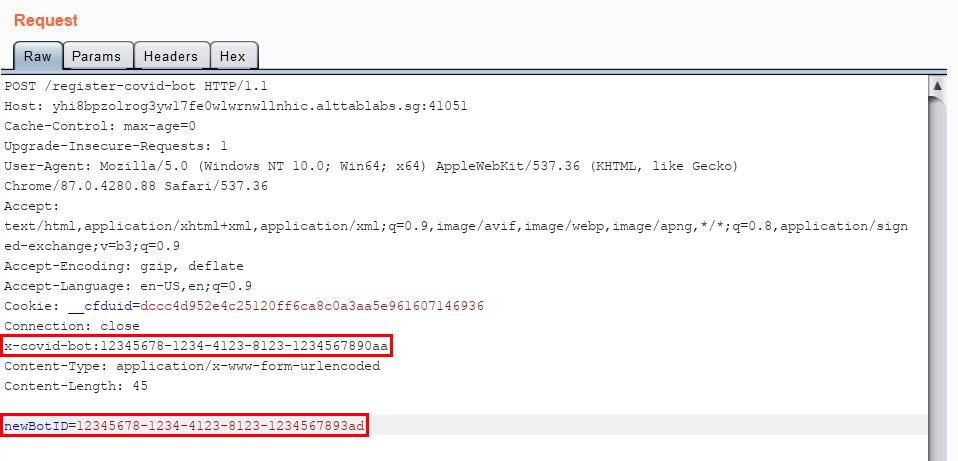
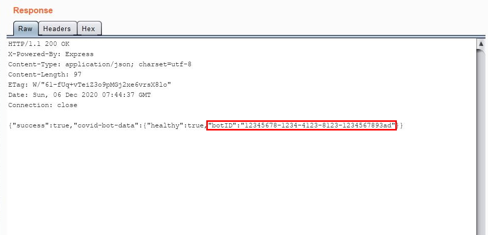
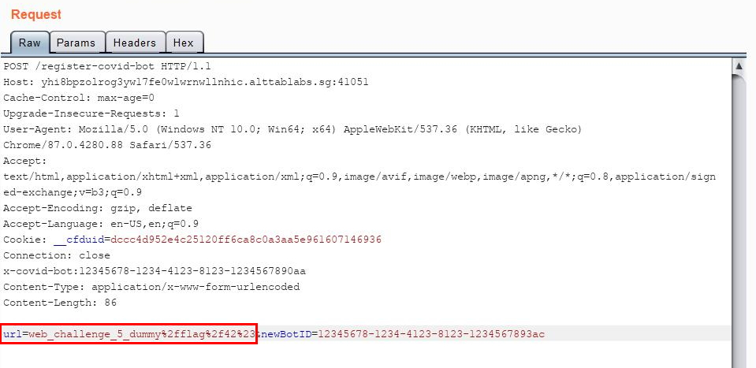
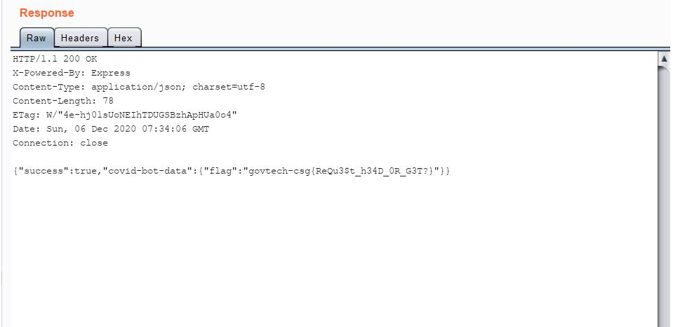

# [WEB] Breaking Free

## Background

The description given for this challenge was:
```
Our agents managed to obtain the source code from the C2 server that COViD's bots used to register upon infecting its victim. Can you bypass the checks to retrieve more information from the C2 Server?
```

A single source code file was given, a routing file for [ExpressJS](https://expressjs.com/en/guide/routing.html).

## Codebase Analysis

Since there is only one file available, I began to analyze the various routings. There are only 2 end-points, either sending a `GET` or `POST` request to `/register-covid-bot`:

```js
// dist.js

//registers UUID associated with covid bot to database
router.get("/register-covid-bot", (req, res) => {
    // ...
}

//Change a known registered UUID
router.post("/register-covid-bot", (req, res) => {
    // ...
}
```

I also saw that there is some form of validation performed on incoming HTTP requests to `/register-covid-bot` on the server-end:

```js
//Validates requests before we allow them to hit our endpoint
router.use("/register-covid-bot", (req, res, next) => {
  var invalidRequest = true;

  if (req.method === "GET") {
    if (req.query.COVID_SECRET && req.query.COVID_SECRET === COVID_SECRET) {
      invalidRequest = false;
    }
  } else {//Handle POST
    let covidBotID = req.headers['x-covid-bot']
    if (covidBotID && covidBotID.match(COVID_BOT_ID_REGEX)) {
      invalidRequest = false;
    }
  }

  if (invalidRequest) {
    res.status(404).send('Not found');
  } else {
    next();
  }
});
```
It seems like the variable `invalidRequest` is set to `true` by default, and meeting certain conditions would set it to `false`. The goal is to set this variable to `false` so that I do not get a short-circuited `404` response from the server.

At the `if` clause, if the request method is `GET`, I would need to supply a parameter `COVID_SECRET` that matches this secret string. If it matches, then `invalidRequest` will be set to `false`. Since there are no hints as to its whereabouts at all, I thought that this might not be the way forward. The string checking looks proper as well.

Now, looking at the `else` clause, in order to set `invalidRequest` to `false`, I would need to supply a HTTP request header, `x-covid-bot`, set to the value that matches `COVID_BOT_ID_REGEX`. Since this clause catches all other supported HTTP methods, I found the comment ("`//Handle POST`") to be *kinda sus* (**suspicious**). If the web server supports other HTTP methods, this `else` clause is going to catch them as well, thus not limiting to just `POST`.

Anyway, the `COVID_BOT_ID_REGEX` is located near the top of the file:

```js
const COVID_BOT_ID_REGEX = /^[a-f0-9]{8}-[a-f0-9]{4}-4[a-f0-9]{3}-[89aAbB][a-f0-9]{3}-[a-f0-9]{12}$/g;
```

> This regex matches an [Universally Unique Identifier (UUID)](https://en.wikipedia.org/wiki/Universally_unique_identifier) formatted string.

This regex is quite straight-forward to match, so I used the string `12345678-1234-4123-8123-1234567890ab`.

Time to check which HTTP methods are supported by sending an `OPTIONS` [HTTP request](https://developer.mozilla.org/en-US/docs/Web/HTTP/Methods/OPTIONS)! I have also added the `x-covid-bot` header with the value set to the string above.

<p align="center">
    <br/>
    
</p>

Well, it appears that besides `GET` and `POST`, I am able to send a `HEAD` request as well. This is a **huge** deal since in ExpressJS, `HEAD` method **defaults to `GET` routing** if it is [not explicitly routed](https://expressjs.com/en/api.html#router.METHOD)!

> Not getting a `404` response meant that my `OPTIONS` request went through the `else` clause.

## Time to `GET` my own COVID Bot!

Since I am able to use the HTTP `HEAD` request method, I can now enter the `GET` routing at `/register-covid-bot` without knowing the `COVID_SECRET`!

```js
// dist.js

//registers UUID associated with covid bot to database
router.get("/register-covid-bot", (req, res) => {
  let { newID } = req.query;

  if (newID.match(COVID_BOT_ID_REGEX)) {
    //We enroll a maximum of 100 UUID at any time!!
    dbController.addBotID(newID).then(success => {
      res.send({
        "success": success
      });
    });
  }
}
```

This function allows me to add my own bot ID to the server's database. In order to do so, my request must contain the parameter `newID` with the value set to the bot ID that I wish to add. Thus, the HTTP request that I will send to register my bot is:

<p align="center">
    <br/>
    
</p>

> 🤖: My name is: `12345678-1234-4123-8123-1234567890aa`

Excellent, I now have my own COVID bot!

## `POST` Away my Old Bot

`POST` routing has the same condition as before, having an `x-covid-bot` HTTP header containing a valid UUID. The function used for the `POST` routing at `/register-covid-bot` is:

```js
// dist.js

//Change a known registered UUID
router.post("/register-covid-bot", (req, res) => {
  let payload = {
    url: COVID_BACKEND,
    oldBotID: req.headers['x-covid-bot'],
    ...req.body
  };
  if (payload.newBotID && payload.newBotID.match(COVID_BOT_ID_REGEX)) {
    dbController.changeBotID(payload.oldBotID, payload.newBotID).then(success => {
      if (success) {
        fetchResource(payload).then(httpResult => {
          res.send({ "success": success, "covid-bot-data": httpResult.data });
        })
      } else {
        res.send({ "success": success });
      }
    });
  } else {
    res.send({ "success": false });
  }
});
```

It appears that this function takes in an `oldBotID` and `newBotID` from the request header and request parameter respectively (even though the code within the `payload` variable is truncated).

If the `newBotID` exists in the request parameter and matches the `COVID_BOT_ID_REGEX`, a black-box `changeBotID()` function will be called. If this function is successful, the function `fetchResource(payload)` will be called using the `payload` variable.

> From my testing, the `oldBotID` and `newBotID` must be different in order for `changeBotID()` to be successful.

The following is the `fetchResource(payload)` function that will be called in this routing:
```js
// dist.js

async function fetchResource(payload) {
  //TODO: fix dev routing at backend http://web_challenge_5_dummy/flag/42
  let result = await axios.get(`http://${payload.url}/${payload.newBotID}`).catch(err => { return { data: { "error": true } } });
  return result;
}
```

It is time for me to test this routing. I set my `x-covid-bot` request header to the UUID of the bot that I registered previously (`12345678-1234-4123-8123-1234567890aa`), and my request parameter `newBotID` to `12345678-1234-4123-8123-1234567893ad`:

<p align="center">
    <br/>
    
</p>

> 🤖: My **old** name was : `12345678-1234-4123-8123-1234567890aa`
>
> 🤖: My **new** name is&nbsp;&nbsp; : `12345678-1234-4123-8123-1234567893ad`

Being able to change my bot ID is cool but... where is the flag?

## Time for a Turnabout!

I noticed that a comment in the `fetchResource(payload)` function mentioned a URL at `http://web_challenge_5_dummy/flag/42`. The flag is likely to be there, but there is a problem.

```js
const COVID_BACKEND = "web_challenge_5_dummy";
// ...

payload {
    url: COVID_BACKEND,
    ...
}
// ...

axios.get(`http://${payload.url}/${payload.newBotID}`)
```

How do I reach this URL since `payload.newBotID` (which is controllable by me) needs to be regex compliant? Also, `payload.url` is hard-coded to contain the `COVID_BACKEND` variable which stores `"web_challenge_5_dummy"`.

**Or is it?**

It was possible for me to **override** the default `payload.url` variable by specifying a `url` parameter in my `POST` request! This is because the server parses the entire request body data and no validation for the variable names are done. This is great, as now I can **control** what goes into the `${payload.url}` template literals!

However, I no longer want the rest of the URL (`/${payload.newBotID}`). Since I am controlling this URL string via the `${payload.url}` template literals, I can simply "truncate" the remaining URL string by using a hash symbol (`#`).

Thus, I need to set my `url` to: `web_challenge_5_dummy/flag/42#anything-else-does-not-matter`

Let's **send** it!

<p align="center">
    <br/>
    
</p>

Excellent, I have managed to reach the `/flag/42` end-point, which gave me the flag for this challenge:
```
govtech-csg{ReQu3$t_h34D_0R_G3T?}
```
