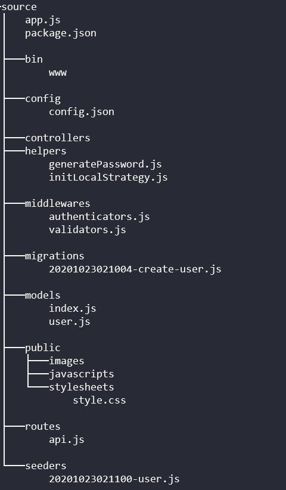
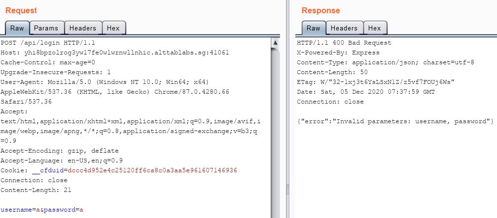
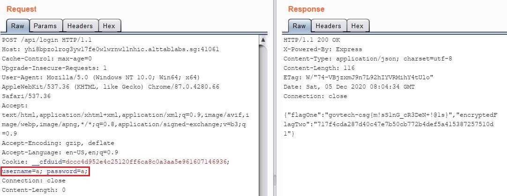
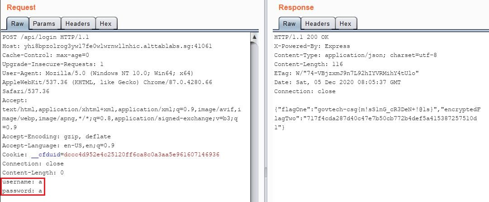

# [WEB] Logged In

## Background

The description given for this challenge was:
```
It looks like COViD's mobile application is connecting to this API! Fortunately, our agents stole part of the source code. Can you find a way to log in?
```

Most of the source code for this challenge was given, so let's get down to it!

## Codebase Analysis
After proceeding to download the source, I found out that it was based-off [express-generator](https://expressjs.com/en/starter/generator.html).

<p align="center">
    
</p>

Realizing this, the first file that I looked at was the `app.js` configuration file.

```js
//app.js

// ...

var apiRouter = require('./routes/api');

// ...

app.use('/api', apiRouter);
```

One of the first things I notice was that the application will be using the routings defined in the `/routes/api.js` file. Opening up that file shows a few routings:

```js
// /routes/api.js

var { loginValidator, sendValidationErrors } = require('../middlewares/validators');
var { localAuthenticator } = require('../middlewares/authenticators');
var { User } = require('../models')

router.get('/', function (req, res, next) {
    res.render('index', { title: 'Express' });
});

router.post('/login', loginValidator, sendValidationErrors, localAuthenticator, function (req, res) {
    res.json({ "flagOne": process.env.FLAG_ONE, "encryptedFlagTwo": encryptFlag(process.env.FLAG_TWO) })
});

router.get('/user/:userId', async function (req, res) {
    const user = await User.findByPk(req.params.userId, { "attributes": ["username"] });
    res.json(user)
});
```

This means that there are 3 end-points that are defined:
1. `GET` - http://www.yhi8bpzolrog3yw17fe0wlwrnwllnhic.alttablabs.sg:41061/api/
2. `GET` - http://www.yhi8bpzolrog3yw17fe0wlwrnwllnhic.alttablabs.sg:41061/api/user/{USER_ID}
3. `POST` - http://www.yhi8bpzolrog3yw17fe0wlwrnwllnhic.alttablabs.sg:41061/api/login


## End-points Analysis

### `GET` at /api/

```js
// /routes/api.js

router.get('/', function (req, res, next) {
    res.render('index', { title: 'Express' });
});
```

From the source code, all this end-point does is to render a HTML page "index", but it is of not much use since it is a static page and this HTML source was not available as well.

### `GET` at /api/user/{USER_ID}

```js
// /routes/api.js

router.get('/user/:userId', async function (req, res) {
    const user = await User.findByPk(req.params.userId, { "attributes": ["username"] });
    res.json(user)
});
```

From the source code, the response sent by this end-point will contain the requested `{USER_ID}`'s `username` attribute. This is not fully useful since I would still require the `password`.

> I tried to test if this parameter was vulnerable to SQL injection, but to no avail.

### `POST` at /api/login

```js
// /routes/api.js

var { loginValidator, sendValidationErrors } = require('../middlewares/validators');
var { localAuthenticator } = require('../middlewares/authenticators');

router.post('/login', loginValidator, sendValidationErrors, localAuthenticator, function (req, res) {
    res.json({ "flagOne": process.env.FLAG_ONE, "encryptedFlagTwo": encryptFlag(process.env.FLAG_TWO) })
});
```

This is the goal of the challenge, so close! I just need to `POST` to `/api/login`, and the flag will be in the HTTP response, right?

**Not so fast!**

When this end-point is called, 3 middlewares: `loginValidator`, `sendValidationErrors` and `localAuthenticator` will be invoked, which are exported by the files `/middlewares/validators.js` and `/middlewares/authenticators.js` respectively.

```js
// /middlewares/validators.js

const loginValidator = [
  check('username').exists(),
  check('password').exists()
]

function sendValidationErrors(req, res, next) {
    const errors = validationResult(req);
    if (!errors.isEmpty()) {
        return res.status(400).json({ error: `Invalid parameters: ${errors.array().map(error => error.param).join(', ')}` });
    }
    next()
}
```

For the `validators.js` file, there are 2 middlewares:
1. `loginValidator` - The server checks if the HTTP request contains `username` and `password` parameters.
2. `sendValidationErrors()` - Any errors from `loginValidator` will be sent as a response.

> **Note:** `loginValidator` middleware is *not a function*, thus having no access to the `req` object.

Seems like the checks are just to see if the parameters `username` and `password` exists, and the parameter values are not actually used.

Notice that in `sendValidationErrors()`, if there are no errors, `next()` is invoked. This is an apparent **logic flaw**, as calling `next()` at this point in time will skip the last middleware `localAuthenticator`. As such, I will omit the analysis for the third middleware.


## Authentication Bypass

In order to get the flag in the HTTP response, I just have to `POST` to http://www.yhi8bpzolrog3yw17fe0wlwrnwllnhic.alttablabs.sg:41061/api/login with the parameters `username` and `password` set to any value. Finally!

Or is it..?



<br/>

Remember that `loginValidator` middleware is not a function, thus it has no access to the `POST` request parameters at all.

Luckily, according to the [express-validator](https://express-validator.github.io/docs/) documentation, the `check()` function will check the following in a request:

* req.body
* req.cookies
* req.headers
* req.params
* req.query

Thus, setting the `username` and `password` parameters in either the request cookies or headers would work.

Cookies method:



<br/>

Headers method:



<br/>

Which gave me the flag for this challenge:
```
govtech-csg{m!sS1nG_cR3DeN+!@1s}
```
